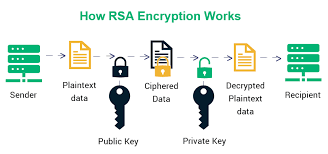

# A simple RSA Encryption with Python

## By ELISABETH Lionel and DO PHAM Alexandre 



RSA is an algorithm used by modern computers to encrypt and decrypt messages. 
It is an asymmetric cryptographic algorithm. 

We have implemented an algorithm capable of generating public and private keys and decrypting messages.
We used `Python` in our script.

```
To Run our script :
You have to run with python the file index.py.
```
